# Complete Project Portfolio

Each project below has its own public GitHub repository with explanation, files, images, result visuals, and a public-safe technical report package.

## 1. Smart Residential Neighborhood Power System

- Repository: [smart-neighborhood-power-system-design](https://github.com/MHMADYHYA/smart-neighborhood-power-system-design)
- Explanation: Low-voltage smart residential neighborhood design with load estimation, voltage-drop checks, short-circuit calculations, protection coordination, PV/BESS/EV integration, and electrical drawing package.
- Files and results: `engineering_drawings/`, `assets/images/`, `assets/rendered_report_pages/`, `docs/full_report_redacted.md`, `docs/public_file_coverage.md`.
- Technologies: Power systems, IEC 60909, protection coordination, PV, BESS, EV charging, AutoCAD/DXF.

## 2. USB 3.0 High-Speed PCB Signal Integrity

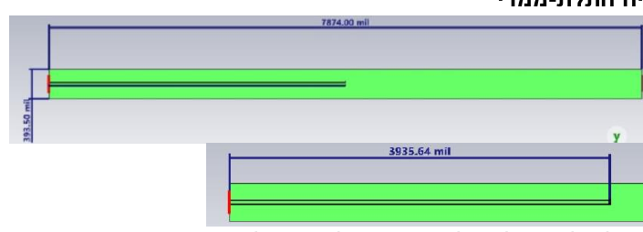

- Repository: [usb3-high-speed-pcb-signal-integrity](https://github.com/MHMADYHYA/usb3-high-speed-pcb-signal-integrity)
- Explanation: High-speed USB 3.0 channel design and signal-integrity review with 3D routing views, S-parameters, eye diagram, TDR, and IBIS model context.
- Files and results: `models/TUSB8041RGC.ibs`, `assets/images/`, `assets/rendered_report_pages/`, `assets/extra_document_media/`, `docs/full_report_redacted.md`.
- Technologies: PCB design, USB 3.0, signal integrity, S-parameters, TDR, EMC, IBIS.

## 3. Three-Phase Load Balancing and Power-Factor Correction

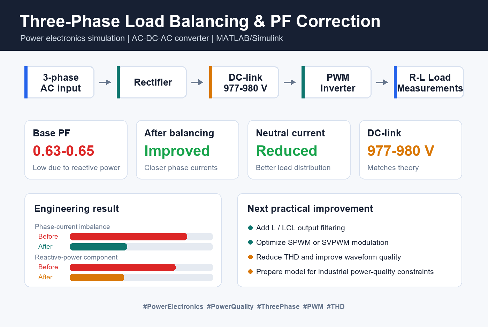

- Repository: [three-phase-load-balancing-power-electronics](https://github.com/MHMADYHYA/three-phase-load-balancing-power-electronics)
- Explanation: Three-phase power-electronics simulation covering rectifier, DC link, PWM inverter, R-L load behavior, power-factor correction, RMS/P/Q/S calculations, and FFT/harmonic review.
- Files and results: `assets/images/`, `assets/presentation_media/`, `assets/poster_pages/`, `docs/full_report_redacted.md`, `docs/public_file_coverage.md`.
- Technologies: MATLAB, Simulink, PWM, FFT, power electronics, power quality.

## 4. ARM Cortex-M Temperature Control Unit

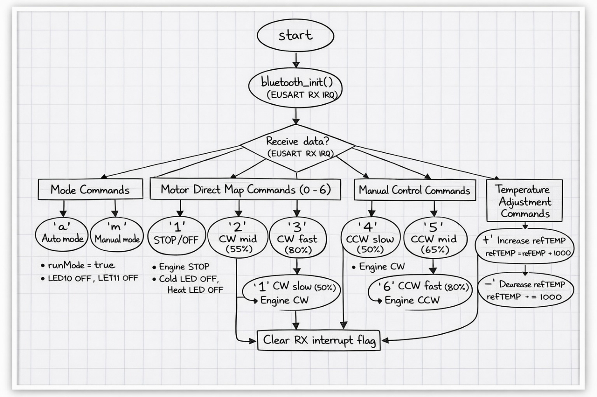

- Repository: [arm-cortex-temperature-control-unit](https://github.com/MHMADYHYA/arm-cortex-temperature-control-unit)
- Explanation: Embedded temperature-control project using an ARM Cortex-M microcontroller, I2C temperature sensing, fan/LED control, PWM, UART/Bluetooth communication, and Simplicity Studio project configuration.
- Files and results: `src/`, `complete_project/simplicity_studio_project/`, `assets/images/`, `assets/presentation_media/`, `assets/appendix_media/`, `docs/full_report_redacted.md`.
- Technologies: C, ARM Cortex-M, EFM32, I2C, PWM, UART, Simplicity Studio.

## 5. FPGA Ultrasonic Distance Meter in VHDL

- Repository: [fpga-ultrasonic-distance-meter-vhdl](https://github.com/MHMADYHYA/fpga-ultrasonic-distance-meter-vhdl)
- Explanation: FPGA-based ultrasonic distance meter with VHDL modules, testbenches, UART transmission, 7-segment display output, ModelSim scripts, and Quartus programming outputs.
- Files and results: `src/`, `sim/`, `quartus/`, `quartus/output_files/`, `assets/images/`, `docs/public_file_coverage.md`.
- Technologies: VHDL, FPGA, Quartus, ModelSim, UART, 7-segment display.

## 6. Full-Custom 8-bit ALU VLSI Design

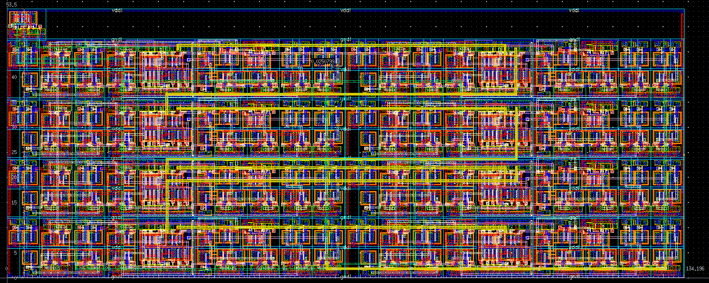

- Repository: [vlsi-8bit-alu-cadence](https://github.com/MHMADYHYA/vlsi-8bit-alu-cadence)
- Explanation: Full-custom 8-bit ALU design with schematic hierarchy, transistor-level design, layout, DRC/connectivity review, timing waveform images, and implementation documentation.
- Files and results: `assets/images/`, `assets/all_extracted_figures/`, `assets/contact_sheets/`, `assets/full_report_media/`, `docs/full_report_redacted.md`.
- Technologies: VLSI, CMOS, Cadence Virtuoso, Spectre, digital design, ALU.

## 7. Real-Time ECG QRS Detection on TI OMAP-L138 DSP

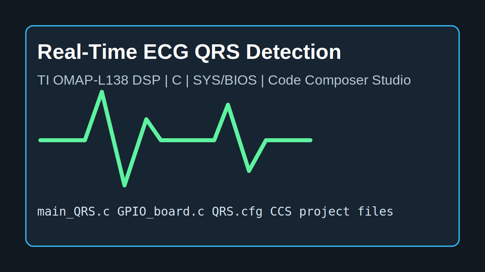

- Repository: [dsp-qrs-ecg-ti-omap](https://github.com/MHMADYHYA/dsp-qrs-ecg-ti-omap)
- Explanation: Real-time ECG QRS detection project on TI OMAP-L138/C674x DSP with embedded C, GPIO board support, SYS/BIOS configuration, Code Composer Studio project files, and timing-oriented implementation.
- Files and results: `src/`, `ccs_project/`, `complete_project/ccs_qrs_project/`, `docs/full_report_redacted.md`, `docs/public_file_coverage.md`.
- Technologies: C, TI OMAP-L138, C674x DSP, TI-RTOS/SYS-BIOS, Code Composer Studio.

## 8. ESP32 Competitive Robot Control System

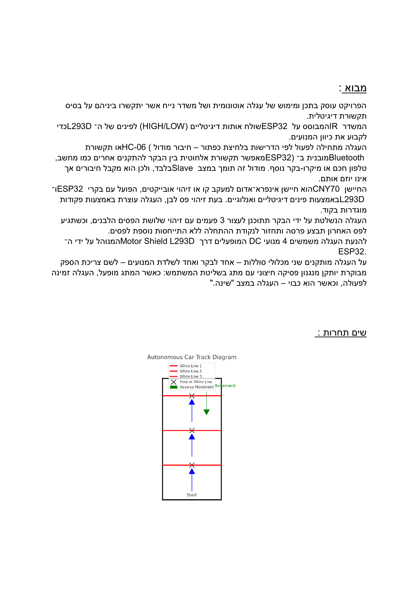

- Repository: [esp32-competitive-robot-control](https://github.com/MHMADYHYA/esp32-competitive-robot-control)
- Explanation: Competitive robot control design using ESP32, Bluetooth control, motor driver circuitry, CNY70 sensors, DC motors, and embedded control architecture.
- Files and results: `assets/images/`, `assets/rendered_report_pages/`, `docs/full_report_redacted.md`, `docs/public_file_coverage.md`.
- Technologies: ESP32, Bluetooth, CNY70, DC motors, L293D, embedded control.

## 9. Digital Memory Game in Logisim-Evolution

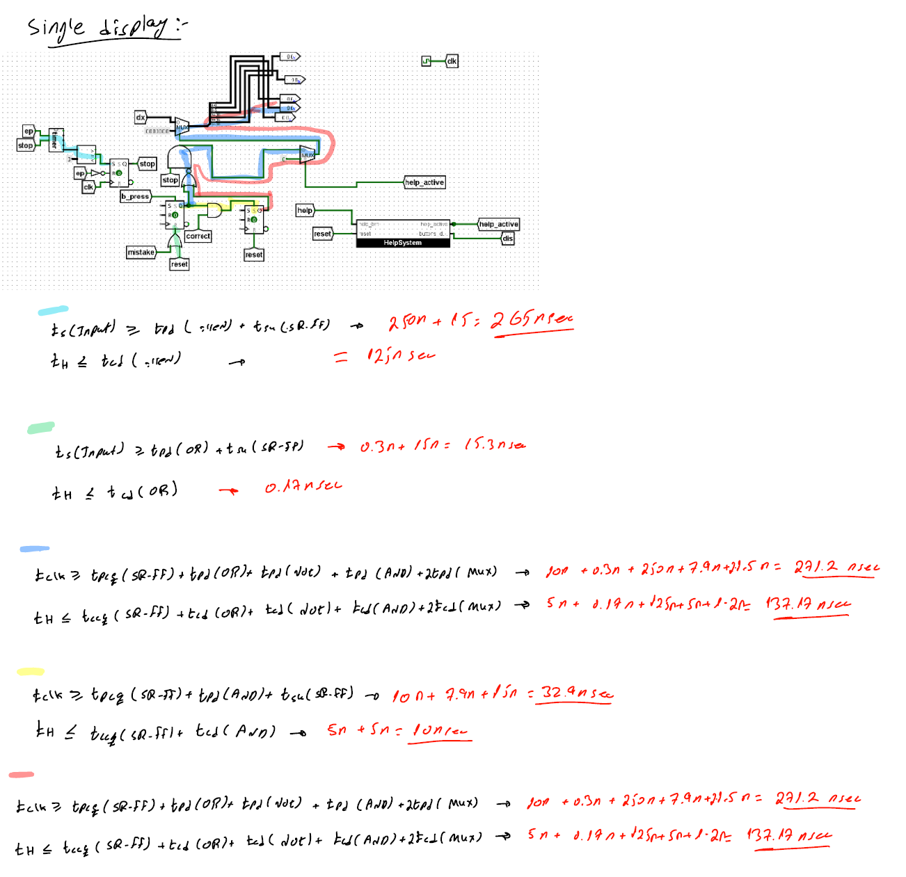

- Repository: [logisim-digital-memory-game](https://github.com/MHMADYHYA/logisim-digital-memory-game)
- Explanation: Digital memory game implemented in Logisim-Evolution using finite-state-machine logic, ROM resources, sequential logic, combinational logic, and circuit-level design documentation.
- Files and results: `logisim/`, `resources/`, `assets/full_report_media/`, `docs/full_report_redacted.md`, `docs/public_file_coverage.md`.
- Technologies: Logisim-Evolution, FSM, ROM, sequential logic, combinational logic.

## 10. Parallel Image Processing Pipeline

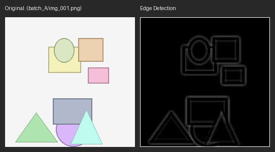

- Repository: [parallel-image-processing-os](https://github.com/MHMADYHYA/parallel-image-processing-os)
- Explanation: Python operating-systems project that processes image batches with manual multiprocessing, queues, worker coordination, result output, visualization scripts, and generated analysis report material.
- Files and results: `main.py`, `image_processor.py`, `image_filters.py`, `images/`, `output/`, `reports/`, `assets/rendered_report_pages/`, `create_project_report.py`.
- Technologies: Python, multiprocessing, Pillow, queues, image processing.

## 11. Campus Navigation and Fiber Deployment System

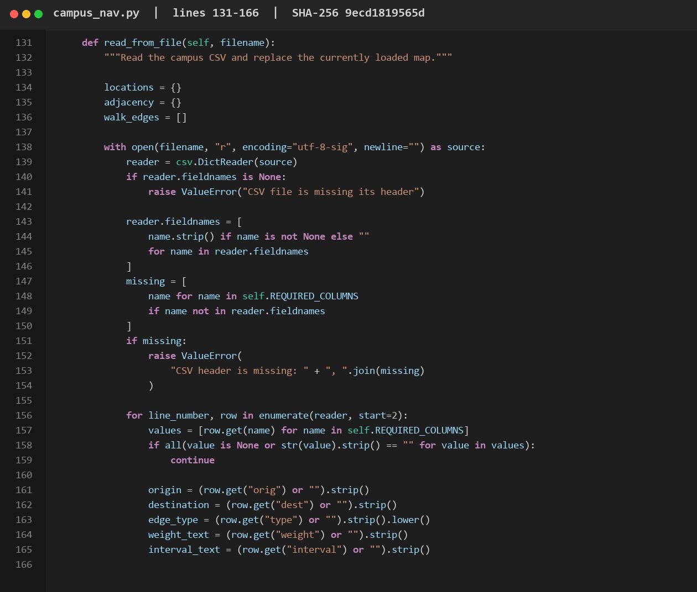

- Repository: [campus-navigation-data-structures](https://github.com/MHMADYHYA/campus-navigation-data-structures)
- Explanation: Data-structures project for campus navigation and fiber deployment using graph modeling, shortest-path search, MST/fiber planning, CSV data, test cases, and alternate code versions.
- Files and results: `campus_nav.py`, `test_campus_nav.py`, `campus_map.csv`, `alternate_versions/`, `examples/sorting/`, `assets/extra_report_media/`, `docs/assignment_pages/`.
- Technologies: Python, graphs, Dijkstra, Kruskal, Union-Find, CSV.

## 12. Pneumonia Detection from Chest X-Rays with CNNs

- Repository: [pneumonia-detection-cnn-xray](https://github.com/MHMADYHYA/pneumonia-detection-cnn-xray)
- Explanation: Deep-learning project for chest X-ray pneumonia classification using CNN models, transfer learning, multiclass/binary classification scripts, evaluation code, and report visuals.
- Files and results: `scripts/`, `requirements.txt`, `assets/images/`, `assets/full_report_media/`, `docs/full_report_redacted.md`, `docs/public_file_coverage.md`.
- Technologies: Python, TensorFlow, Keras, CNN, ResNet50V2, scikit-learn, Matplotlib, Seaborn.

## 13. Network QoS and Congestion Control Design

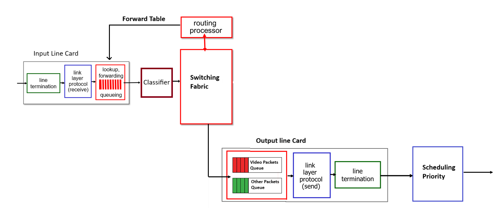

- Repository: [network-qos-congestion-control](https://github.com/MHMADYHYA/network-qos-congestion-control)
- Explanation: Computer-networks design project covering QoS, TCP congestion control, DASH streaming, CDN behavior, router architecture, and report diagrams.
- Files and results: `assets/images/`, `assets/full_report_media/`, `docs/full_report_redacted.md`, `docs/public_file_coverage.md`.
- Technologies: Computer networks, TCP, QoS, DASH, CDN, router architecture.

## 14. EMC and Signal Integrity Simulation

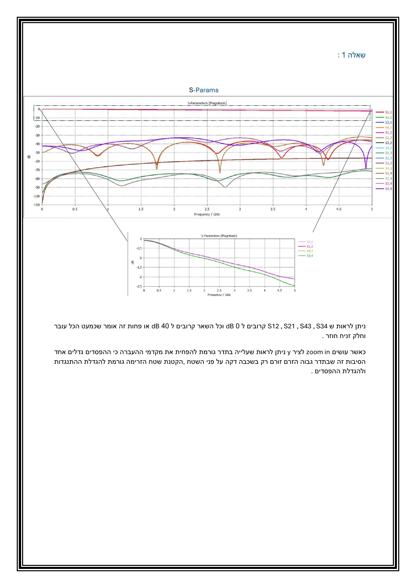

- Repository: [emc-signal-integrity-simulation](https://github.com/MHMADYHYA/emc-signal-integrity-simulation)
- Explanation: EMC and signal-integrity analysis project with S-parameters, TDR, transient results, and rendered public report pages.
- Files and results: `assets/images/`, `assets/rendered_report_pages/`, `docs/full_report_redacted.md`, `docs/public_file_coverage.md`.
- Technologies: EMC, signal integrity, S-parameters, TDR, transient analysis.

